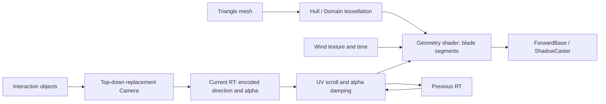

# Interactive-dynamic-grassland

Unity Built-in Render Pipeline 的动态交互草地 Shader / C# 源码示例：用 Geometry Shader 生成草叶、Tessellation 控制密度，并通过交互相机的 Render Texture 实现弯曲、衰减与风动。

当前仓库提供核心源码，不是可直接用 Hub 打开的完整 Unity 工程：没有 `ProjectSettings/`、`Packages/`、场景、`.meta` 或预览截图。原项目的准确 Unity 版本无法从这些文件确定，导入方法见下文。

## 项目特点

- 使用几何着色器生成草叶，减少手工建模成本。
- 使用细分着色器提高地表草地密度和表现力。
- 通过摄像机生成交互纹理，实现草地受力、恢复和拖尾效果。
- 支持风动、颜色渐变、阴影和草叶弯曲控制。

## 核心文件

- `Assets/Grass.shader`：主草地着色器，负责草叶生成、风动和交互偏移。
- `Assets/Materials/Interaction.cs`：交互控制脚本，挂在摄像机上，负责生成交互纹理。
- `Assets/Materials/Interaction Shader.shader`：交互绘制用着色器，将接触区域写入纹理。
- `Assets/Materials/Interaction Post Shader.shader`：交互后处理着色器，用于衰减和拖尾。
- `Assets/Shaders/CustomTessellation.cginc`：细分着色器公共 include。
- `Assets/Shaders/TessellationExample.shader`：细分着色器示例文件。
- `Assets/Materials/Toon.shader`：卡通风格着色器示例。

## 使用方式

使用 **Built-in Render Pipeline** 工程与支持 Shader Model 5.0、Geometry/Hull/Domain Shader 的图形后端。源码依赖 `UnityCG.cginc`、`AutoLight`、`ForwardBase` / `ShadowCaster` 与 `OnRenderImage`；Unity 官方说明 [`OnRenderImage` 不支持 SRP](https://docs.unity3d.com/2022.3/Documentation/ScriptReference/MonoBehaviour.OnRenderImage.html)，因此当前代码需要迁移后才能用于 URP/HDRP。原参考教程使用的 Editor 版本不等于本仓库已验证的版本。

1. 新建 Built-in 3D 工程，或在已有工程中建立测试场景。将本仓库 `Assets/` 内容复制进去，保留相对目录，使 `Grass.shader` 能找到 `Shaders/CustomTessellation.cginc`；Unity 将生成本地 `.meta`。
2. 为一个带法线和切线的三角形网格创建草地材质，Shader 选择 `Roystan/Grass With Interaction`。提供风场纹理，先用较小的 `_TessellationUniform`，设置草高、宽度与颜色；场景放置 Directional Light。
3. 建立一台从正上方俯视地面 XZ 平面的 **正交 Camera**，挂上 `Interaction.cs`。让它只通过 Culling Mask 渲染交互对象/代理，排除草地和无关场景。设置清屏色 Alpha 为 0。
4. 在脚本中指定 `InteractionShader` 为 `Interaction` Shader，`InteractionPostShader` 为 `InteractionPostShader` Shader，并给 `_InteractionRange` 指定有效 Transform。`_RTScale` 必须大于 0；它控制 Camera 的正交半宽及世界空间采样范围。
5. 脚本会创建两张 1024×1024 ARGB32 Render Texture。移动交互对象或移动交互相机，在主相机中检查草叶方向、压低和痕迹恢复；相机跟随对象的逻辑需要在测试场景自行配置。

这些步骤是根据源码整理的场景装配说明。本次环境没有 Unity Editor，未执行导入、Shader 编译或运行验证，也未生成新的效果预览。

## Shader pipeline

交互纹理的 RG 编码推开方向，Alpha 编码强度；草地从世界 XZ 映射到交互相机范围采样。后处理用相机位移换算 UV 偏移，比较本帧与衰减后的历史强度，保留更强的方向数据。Geometry Shader 在每个细分三角形的第一个顶点生成一片草叶，风场与交互按草叶高度影响顶点。

当前 `BLADE_SEGMENTS = 3`，每轮循环发出两个顶点，最后发出一个顶点，因此 `maxvertexcount` 必须覆盖 `2 * BLADE_SEGMENTS + 1 = 7`。此次修复将原来只声明 5 个顶点的上限改为 7，保留原草叶形状算法。

## 参数说明

- `_RTScale`：交互范围大小。
- `_DampingSpeed`：交互痕迹衰减速度。
- `_InteractionStrength`：水平推开强度。
- `_InteractionStrengthOfHeight`：草叶高度方向的压低强度。
- `_BladeHeight` / `_BladeWidth` / `_BladeCurve`：草叶外形控制。
- `_WindStrength` / `_WindFrequency`：风动效果控制。

## 参考来源

- 草叶几何、细分与风动的教程基础：[Roystan — Grass Shader](https://roystan.net/articles/grass-shader/)。
- 细分程序结构：[Catlike Coding — Tessellation](https://catlikecoding.com/unity/tutorials/advanced-rendering/tessellation/)，原注释也保留在 `CustomTessellation.cginc` 中。

交互相机、世界 XZ 采样、UV 位移历史纹理与衰减混合是当前源码中的扩展部分；草叶与 Tessellation 的教程基础保持明确归属，不包装为完全原创设计。

## 说明

当前仓库适合作为小型 Shader 阅读和装配实验。还需要补上经过验证的 Editor 版本、场景/风纹理、自己的效果预览，以及持久 Render Texture/Material 的生命周期清理；这些工作尚未在本次整理中完成。根目录 LICENSE 保持原状，教程引用不替代第三方源码的原始许可。
